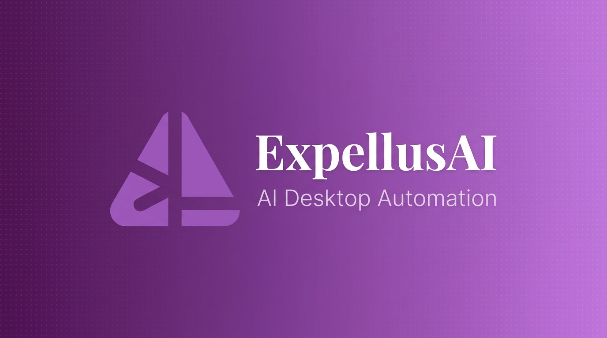
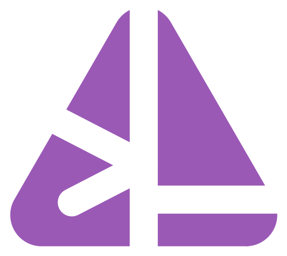

  

  <strong>AI-powered desktop automation that sees your screen, understands context, and acts.</strong>

  
  
  
  

  

> [!NOTE]
> **ExpellusAI is currently in closed beta.** To get early access, visit [expellusai.com](https://expellusai.com) and join the waitlist. We're onboarding new users in waves, so sign up to secure your spot!

---

Just tell your computer what to do. ExpellusAI uses AI to **see your screen**, **understand the context**, and **automate any desktop task**, no coding required.

> *"We built ExpellusAI because following AI instructions shouldn't be harder than the task itself. You ask a chatbot how to change a setting, and it gives you a guide. But the menu moved. The button got renamed. The steps don't match your screen. We thought: what if AI could just do it for you instead?"*

 

## See It in Action

<strong>Desktop Automation</strong>: Automate any Windows app with natural language

 
<video src="https://rvcslyhyhkarxwueajkb.supabase.co/storage/v1/object/public/landing-page-images/demo/DeskAuto.mp4" controls width="100%"></video>

<strong>Multi-App</strong>: Seamless cross-application workflows

 
<video src="https://rvcslyhyhkarxwueajkb.supabase.co/storage/v1/object/public/landing-page-images/demo/Multiapp.mp4" controls width="100%"></video>

<strong>Browser</strong>: Web browsing, research, and data extraction

 
<video src="https://rvcslyhyhkarxwueajkb.supabase.co/storage/v1/object/public/landing-page-images/demo/Browser.mp4" controls width="100%"></video>

<strong>System Control</strong>: System settings, file management, terminal

 
<video src="https://rvcslyhyhkarxwueajkb.supabase.co/storage/v1/object/public/landing-page-images/demo/Sysconfig.mp4" controls width="100%"></video>

<strong>DevTools</strong>: Code editing, debugging, and dev workflows

 
<video src="https://rvcslyhyhkarxwueajkb.supabase.co/storage/v1/object/public/landing-page-images/demo/DevTools.mp4" controls width="100%"></video>

 

## Why ExpellusAI

<table>
  <tr>
    <td width="50%">

### Calibration Module
Our proprietary multi-layered Calibration Module pinpoints UI elements with pixel-level accuracy. Instead of relying on approximate coordinate guessing, ExpellusAI precisely locates buttons, fields, and controls before every interaction.

</td>
    <td width="50%">

### Desktop + Web, Unified
One agent handles **both** desktop applications and web browsers in a single session. Switch between Excel, Chrome, Zoom, and more without breaking your workflow.

</td>
  </tr>
  <tr>
    <td>

### Fully Local, No VM Required
Runs directly on your real Windows desktop. No Docker containers, no virtual machines, no cloud sandboxes. Your data **never leaves your device**.

</td>
    <td>

### Visual Interface, Zero Setup
Build and run automations through an intuitive GUI. No coding, no terminal commands, no API keys. Just describe what you want and let the AI handle it.

</td>
  </tr>
</table>

 

## Key Features

<table>
  <tr>
    <td width="50%">

### Natural Language Control
Describe your task in plain English. The AI understands your screen and performs the work automatically.

</td>
    <td width="50%">

### Universal App Compatibility
Works with **any** Windows application visible on your screen, no APIs or plugins required.

</td>
  </tr>
  <tr>
    <td>

### Real-Time User Control
Stay in charge with **Pause** and **Stop** controls. Intervene at any point during automation, review what's happening, and decide how to proceed.

</td>
    <td>

### Secure Local Vault
Store credentials and personal data locally. Sensitive information is never exposed to the AI model and **never leaves your device**.

</td>
  </tr>
  <tr>
    <td>

### Multi-Language Detection
Recognizes screen text in **12+ languages** including English, Korean, Japanese, Chinese, and more. GPU acceleration supported.

</td>
    <td>

### Workflow Builder
Design automation flows visually with drag-and-drop. Save them and execute repeatedly with ease.

</td>
  </tr>
</table>

 

## Quick Start

**1. Join the Waitlist**: Sign up at [expellusai.com](https://expellusai.com) to get early access to the beta.

**2. Download**: Once approved, get the latest installer from [expellusai.com/product](https://expellusai.com/product).

**3. Install**: Run the installer and follow the setup wizard. Choose CUDA (GPU) or CPU version.

**4. Automate**: Launch ExpellusAI, type a command like *"Open Chrome and search for today's weather"*, and watch it work.

> Need help? Check our [Installation Guide](https://expellusai.com/product/installation) and [Windows Security Guide](https://expellusai.com/resources/windows-security-guide) if you see SmartScreen warnings.

 

## Tutorials & Documentation

| Resource | Description |
|----------|-------------|
| [Getting Started](https://expellusai.com/documentation/getting-started) | First steps with ExpellusAI |
| [Installation Guide](https://expellusai.com/product/installation) | Detailed installation instructions |
| [Features & Updates](https://expellusai.com/documentation/features-updates) | Full feature list and changelog |
| [FAQ](https://expellusai.com/documentation/faq) | Frequently asked questions |
| [Windows Security Guide](https://expellusai.com/resources/windows-security-guide) | SmartScreen & Smart App Control |

 

## Latest Updates

See the full [Changelog](CHANGELOG.md) for detailed version history.

### Beta 0.2.0, March 2026 *(Latest)*
- Prompt history & update checker
- Redesigned UI/UX
- Bug fixes, performance & security improvements

### Beta 0.1.3, March 2026
- Follow-up on finished tasks & context continuation
- DPI-aware image rendering & bug fixes

### Beta 0.1.0, February 2026
- Initial deployment with core automation features
- Natural language control, screen understanding, workflow builder

 

## Community

We'd love to hear from you:

- **[Discussions](../../discussions)**: Ask questions, share ideas, show off your automations
- **[Issues](../../issues)**: Report bugs or request features
- **[Website](https://expellusai.com)**: Product info and documentation
- **[Contact](https://expellusai.com/contact)**: Reach out directly

 

## Legal

- [Terms and Conditions](https://expellusai.com/terms)
- [Privacy Policy](https://expellusai.com/privacy)
- [End User License Agreement](LICENSE)

ExpellusAI is proprietary software developed by **Team LazyTech**. All rights reserved.

---

  
   
  Made with precision by Team LazyTech

